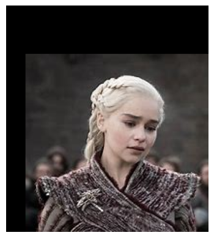
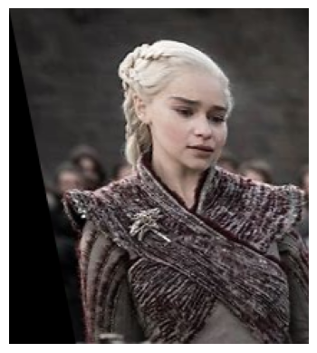
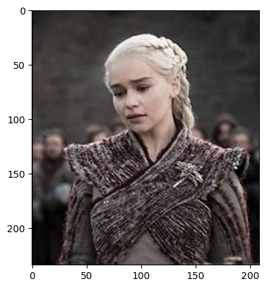
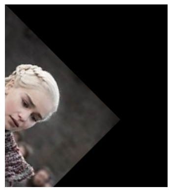
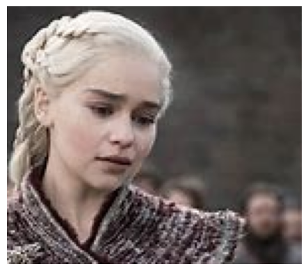

# Image-Transformation
## Aim
To perform image transformation such as Translation, Scaling, Shearing, Reflection, Rotation and Cropping using OpenCV and Python.

## Software Required:
Anaconda - Python 3.7

## Algorithm:
### Step1:
Import the necessary libraries and read the original image and save it as a image variable.

### Step2:
Translate the image.

### Step3:
Scale the image.
### Step4:
Shear the image.

### Step5:
Find reflection of image.

### step6:
Rotate the image.
### Step7:
Crop the image.
### Step8:

Display all the Transformed images.

## Program:
```python
## Developed By: Kavinraja D
i)Image Translation
import numpy as np
import cv2
import matplotlib.pyplot as plt
input_img=cv2.imread("lion.jpg")
input_img=cv2.cvtColor(input_img,cv2.COLOR_BGR2RGB)
plt.axis('off')
plt.imshow(input_img)
plt.show()
rows,cols,dim=input_img.shape
M=np.float32([[1,0,20],
             [0,1,50],
             [0,0,1]])
translated_img=cv2.warpPerspective(input_img,M,(cols,rows))
plt.axis('off')
plt.imshow(translated_img)
plt.show()

ii) Image Scaling
M=np.float32([[1.5,0,0],
             [0,2,0],
             [0,0,1]])
scaled_img=cv2.warpPerspective(input_img,M,(cols,rows))
plt.axis('off')
plt.imshow(scaled_img)
plt.show()


iii)Image shearing
M_x=np.float32([[1,0.2,0],
               [0,1,0],
               [0,0,1]])
M_y=np.float32([[1,0,0],
               [0.4,1,0],
               [0,0,1]])
sheared_img_xaxis=cv2.warpPerspective(input_img,M_x,(cols,rows))
sheared_img_yaxis=cv2.warpPerspective(input_img,M_y,(cols,rows))
plt.axis('off')
plt.imshow(sheared_img_xaxis)
plt.show()
plt.axis('off')
plt.imshow(sheared_img_yaxis)
plt.show()


iv)Image Reflection
##iv)Image Reflection
import numpy as np
import cv2
import matplotlib.pyplot as plt
input_image=cv2.imread("got.jpg") 
input_image=cv2.cvtColor(input_image, cv2.COLOR_BGR2RGB) 
plt.axis("off") 
plt.imshow(input_image)
plt.show()
rows, cols, dim = input_image.shape
M_x=np.float32([[1,0,0],
               [0,-1,rows],
               [0,0,1]])
M_y=np.float32([[-1,0,cols],
               [0,1,0],
               [0,0,1]])
reflected_img_xaxis=cv2.warpPerspective(input_image,M_x,(cols,rows))
reflected_img_yaxis=cv2.warpPerspective(input_image,M_y,(cols,rows))
plt.imshow(reflected_img_yaxis)
plt.show()

v)Image Rotation
##v)Image Rotation:
import numpy as np
import cv2
import matplotlib.pyplot as plt
input_image=cv2.imread("got.jpg") 
input_image=cv2.cvtColor(input_image, cv2.COLOR_BGR2RGB)
angle=np.radians(45)
M=np.float32([[np.cos(angle),-(np.sin(angle)),0],
               [np.sin(angle),np.cos(angle),0],
               [0,0,1]])
rotated_img=cv2.warpPerspective(input_image,M,(cols,rows))
plt.axis('off')
plt.imshow(rotated_img)
plt.show()


vi)Image Cropping
##vi)Image Cropping:

import numpy as np
import cv2
import matplotlib.pyplot as plt
input_image=cv2.imread("got.jpg") 
input_image=cv2.cvtColor(input_image, cv2.COLOR_BGR2RGB)
cropped_img=input_image[20:150,60:230]
plt.axis('off')
plt.imshow(cropped_img)
plt.show()

```
## Output:
### i)Image Translation


### ii) Image Scaling


### iii)Image shearing



### iv)Image Reflection


### v)Image Rotation


### vi)Image Cropping

## Result: 

Thus the different image transformations such as Translation, Scaling, Shearing, Reflection, Rotation and Cropping are done using OpenCV and python programming.
